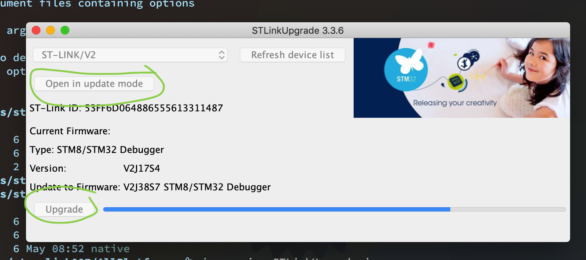

# How run rust embedded program on `Black Pill`


## Install tooling

- `cargo-embed`

    `cargo-embed` allows you to compile your rust program and burn to the `Black Pill`
    (STM32F411) via `ST-LINK`

    ```bash
    cargo install cargo-embed
    ```

    After that, connect the `Black Pill` wih the `ST-LINK` (make sure use 3.3V). Then you
    can see it in the `System Information.app` like below:

    

    Or you can install `cargo-flash` and then run the following command to list the ST-LINK:

    ```bash
    cargo flash --list-probes
    # The following debug probes were found:
    # [0]: STLink V2 (VID: 0483, PID: 3748, Serial: 53C3BF6D0648C2865556133114C287, StLink)
    ```

    </br>

- Add the ARM cortex compile target

    ```bash
    rustup target add thumbv7em-none-eabihf
    ```

</br>

##  Project settings

- Make sure you create the `.cargo/config` with the following settings:

    ```config
    [target.thumbv7em-none-eabihf]
    runner = 'probe-run --chip stm32f411'
    rustflags = [
      "-C", "link-arg=-Tlink.x",
    ]

    [build]
    target = "thumbv7em-none-eabihf"
    ```

    Especially the `--chip stm32f411`, as that's the `Black Pill` chip model.

    </br>

- Make sure you create the `memory.x` with the following settings:

    ```config
    MEMORY
    {
      /* NOTE K = KiBi = 1024 bytes */
      FLASH : ORIGIN = 0x08000000, LENGTH = 64K 
      RAM : ORIGIN = 0x20000000, LENGTH = 32K
    }

    /* This is where the call stack will be allocated. */
    /* The stack is of the full descending type. */
    /* NOTE Do NOT modify `_stack_start` unless you know what you are doing */
    _stack_start = ORIGIN(RAM) + LENGTH(RAM);
    ```

    </br>

- Make sure you have the important setting below in your `Embed.toml`:

    ```toml
    # The protocol to be used for communicating with the target. (ST-LINK)
    protocol = "Swd"


    [default.general]
    # The chip name of the chip to be debugged.
    chip = "STM32F411CEUx"


    [default.rtt]
    # Whether or not an RTTUI should be opened after flashing.
    # Enable `rprintln!()` output
    enabled = true
    ```

    If you don't know the `chip` value, then you can run the following command to find out:

    ```bash
    cargo embed --list-chips | grep F411
    # STM32F411CCUx
    # STM32F411CCYx
    # STM32F411CEUx
    # STM32F411CEYx
    # STM32F411RCTx
    # STM32F411RETx
    # STM32F411VCHx
    # STM32F411VCTx
    # STM32F411VEHx
    # STM32F411VETx
    ```

    Then pick the one matches your board:)

</br>

## Upgrade the ST-Link (USB) hardware

If you see the following error when running `cargo embed`:

```bash
The firmware on the probe is outdated
```

That means your ST-LINK USB firmware needs to be upgrade!!!

Go to [here](https://www.st.com/en/development-tools/stsw-link007.html) download the latest
version and unzip. If you're you running `MacOSX`, then you need to run the upgrade program
like below:

1. Plug the `ST-LINK` USB in

2. Run the command
    ```bash
    cd {THE_ST-LINK_UNZIP_FOLDER}
    java -jar STLinkUpgrade.jar
    ```

3. Press `Open in update mode`, then press `Upgrade` and wait for it to finish.




</br>

## How to compile and run

Make sure connect the `Black Pill` and `ST-LINK` like below (with the correct pins):


Then run `cargo embed` or `cargo embed --release`

```bash
cargo embed
# Compiling test-black-pill v0.1.0 (/Users/wison/temp/test-black-pill)
#    Finished dev [unoptimized + debuginfo] target(s) in 0.32s
#      Config default
#      Target /Users/wison/temp/test-black-pill/target/thumbv7em-none-eabihf/debug/test-black-pill
#     Erasing sectors ✔ [00:00:01] [##################################################################] 48.00KiB/48.00KiB @ 41.97KiB/s (eta 0s )
# Programming pages   ✔ [00:00:00] [##################################################################] 41.00KiB/41.00KiB @ 17.57KiB/s (eta 0s )
#    Finished flashing in 2.078s
```

Then it will print all the `rprintln!(">>> Ready");` to your console for debugging:)


</br>


